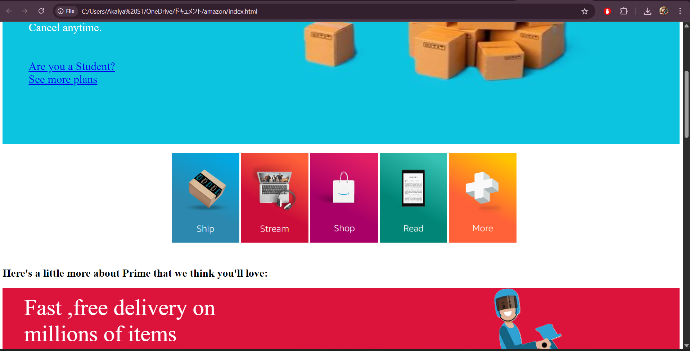

# 🌟 Amazon Prime Landing Page Clone

This is a visually rich front-end clone of the **Amazon Prime** landing page. The project showcases various benefits of Prime membership, including fast delivery, exclusive streaming content, music, reading, and more — presented in a responsive and modern UI.

## 📸 Preview



> 💡 _You can replace `preview.png` with a real screenshot of your project and make sure the image file is placed in the same folder._

## 🛠️ Tech Stack

- **HTML5** for semantic structure
- **CSS3** for design, animations, and responsive layout
- **JavaScript** for slideshow functionality

## 💻 Features

- 📦 Fast delivery section with image and text
- 🎬 Movie slideshow using JavaScript
- 📺 Exclusive Amazon Originals content highlight
- 🎵 Music slider for trending hits
- 📚 Prime Reading benefits section
- 🔄 Interactive hover effects on service cards
- ✅ Fully responsive layout (with media queries)

## 📁 Project Structure

```
📦 amazon-prime-landing-page/
 ┣ 📜 index.html
 ┣ 📜 style.css
 ┣ 🖼️ amazon logo.png
 ┣ 🖼️ amazon hover1.png ... hover5.png
 ┣ 🖼️ amazon movie1.jpg ... movie5.jpg
 ┣ 🖼️ amazon music1.jpg ... music5.jpg
 ┣ 🖼️ amazon reading3.png
 ┣ 🖼️ amazon upload.png
 ┣ 🖼️ amazon footer.png
 ┗ 🖼️ preview.png (optional preview image)
```

## 🚀 How to Run

1. Clone or download this repository.
2. Make sure all image files referenced in the HTML are available in the same directory.
3. Open `index.html` with any web browser (Chrome, Firefox, Edge, etc.)
4. Enjoy the demo experience of Amazon Prime!

## 📌 Note

This is a **static frontend clone project** created for learning and showcasing frontend skills. No backend or API integration is involved.

---

## 🙋‍♀️ Author

**Akalya S T**  
Aspiring Software Developer | Java Full Stack Enthusiast  
[Connect on LinkedIn](https://www.linkedin.com/in/akalya-s-t-8aaba12a0/)
